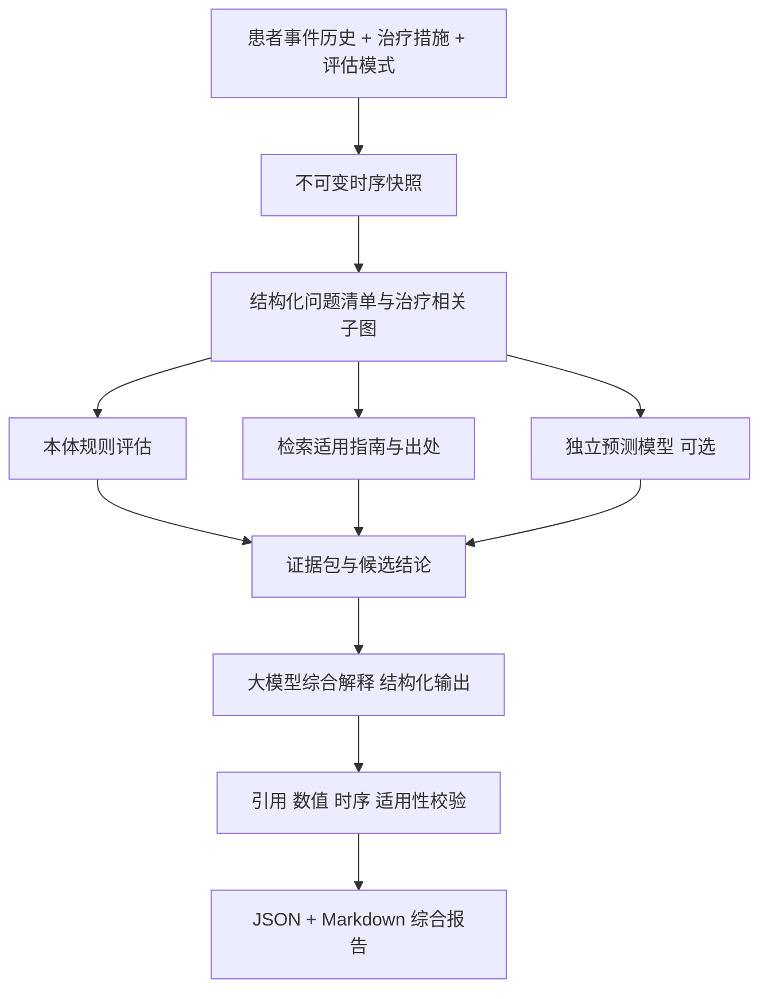

# 治疗措施后的患者综合评估与证据报告

状态：核心流程已实现，实际接口、配置、知识覆盖与限制见 [TREATMENT-ASSESSMENT-API.md](TREATMENT-ASSESSMENT-API.md)。本文保留目标设计；历史知识版本及有效定量模型仍未具备。承接 `TREATMENT-FORECAST-DESIGN.md`；保持 `/simulate` 和 `/patients/{pid}/forecasts` 的既有契约，新增独立报告服务。

## 1. 场景与输出

用户提出：“该患者开始新的治疗措施之后，整体情况可能如何变化？有哪些获益、风险、原因和需要观察的指标？请给出依据。”

系统围绕患者问题清单进行评估：已有事实是什么、治疗与哪些问题相关、哪些变化可由已验证规则判断、哪些只有一般知识支持、哪些无法判断。综合报告不要求所有维度都能输出数值，更不将多个未经训练的模拟值合成为健康评分。

必须区分两种模式：

| 模式 | 输入时间边界 | 可以回答 |
| --- | --- | --- |
| prospective：计划实施后的情景评估 | 决策时点 t0 的可见历史 + 拟实施措施 | 可能的作用方向、适用条件、风险、监测需要；有效模型支持时附定量预测 |
| follow_up：实施后的随访评估 | 治疗前快照 + 实际实施证据 + t1 随访快照 | 实际发生的变化、与目标的差距、需解释的问题；时间先后不能单独证明治疗导致变化 |

首次交付优先 prospective；follow_up 共用报告契约和证据结构。计划用药、开具医嘱、实际给药、患者自述服药必须分别表达。

## 2. 综合评估维度

| 维度 | 患者输入 | 评估输出 |
| --- | --- | --- |
| 糖代谢与管理目标 | 不同语境的血糖、HbA1c、相关症状、既往目标 | 当前状态、证据支持的可能方向、是否支持数值预测 |
| 治疗适用性 | 已确认/疑似诊断、治疗指征、药品/措施编码、适用人群 | 适用、存在限制、资料不足；每项列出成立前提 |
| 安全性与并用治疗 | 既往病史、器官功能、并用药、过敏/不良反应、措施参数 | 已有规则触发的风险、知识提示、未覆盖的检查 |
| 器官与并发症状态 | LIS、PACS 报告、症状、既往诊断 | 已知问题与相关发现，哪些与治疗评估有关、哪些尚不确定 |
| 生活方式与实施情况 | 饮食、活动、体重、依从性、实际实施记录 | 影响评估的背景及缺口，避免将计划当作已执行 |
| 监测与复评 | 既往测量、适用监测条目、来源中的时距 | 观察什么、依据是什么、何时复评；没有时距依据时不编造频率 |

这些维度是评估目录，不表示仓库已经具备完整临床规则。每个维度返回 `assessed / partial / unknown / not_applicable` 和覆盖说明；“没有命中规则”不等于“没有风险”。不生成未经定义和验证的综合风险分数。

## 3. 架构：先形成证据支持的结论，再组织报告



大模型的工作包括：将问题与措施关联、比较支持和反对证据、指出缺失条件、组织多维度解释。它不能把参数初始化演示升级成临床预测，也不能从一般药物机制推出某患者一定会改善。

无需训练新模型即可完成此流程：规则和资料提供证据，现成大模型承担综合表达。是否能给出可信结论取决于输入和证据覆盖，不取决于回答是否流畅。

## 4. 与当前代码衔接

| 当前模块 | 可复用内容 | 新服务必须补充 |
| --- | --- | --- |
| `forecast/service.py` | 事件可见时间过滤、修订版处理思路 | 提取独立 snapshot builder；首期不修改旧接口，先验证行为一致 |
| `domain/generated.py` | 25 个实体类和属性 IRI | 真正组装实体引用、措施关联和上下文，不能只返回 class_iri 列表 |
| `simulate/engine.py` | 隔离 Dataset 中执行规则、收集结论 | 构造报告自己的 as-of 患者图、明确规则覆盖和分支隔离 |
| `query/guidance.py` | 推荐与监测查询、证据分级字段 | 当前查询通常读取已物化状态；历史报告不能直接拿最新结论拼接 |
| `graph/provenance.py`、`graph/passages.py` | 事实/规则/原文来源信息 | 在报告运行中冻结出处、规则和知识版本 |
| `adjudicate/citations.py` | 原文/哈希对应检查 | 增加结论是否被出处支持、患者适用性等检查；哈希正确不能证明结论正确 |
| `adjudicate/claim.py` | 现有类型结论的核对方式 | 仅复用其已支持的结论类型；新报告命题不能声称已被完整裁决 |

V2 业务图与 `https://example.org/dmo#` 规则图使用显式桥接表。报告所用规则结论必须来自同一次快照、同一规则版本；不将数据库当前分层作为过去时点的事实。

## 5. 患者状态与治疗措施

新增 `TreatmentAssessmentRequest`，不受现有 forecast 仅支持 FPG/start 的约束：

- `mode`：prospective / follow_up。
- `baseline_snapshot`：t0、knowledge_cutoff、标准化事件历史与源覆盖区间。
- `follow_up_snapshot`：随访模式必填，t1 > t0。
- `interventions[]`：药物、生活方式、器械或其他措施的结构化描述。
- `assessment_domains[]`：需要评估的维度；默认使用已支持维度并标记未覆盖项。
- `knowledge_mode`：historical / current；历史回放用当时有效知识，当前回顾评估允许用最新知识，但不得冒充当时结论。
- `language`、`include_demo_appendix`：输出语言及是否附初始化数值演示，后者默认 false。

每条 intervention 记录 `action_id、kind、operation、concept_iri/code、planned_start_at、actual_start_at、execution_status、regimen_reference、supporting_event_ids`。外部已给定的方案参数可以作为评估输入，不默认生成药品、剂量或频率。

PatientState 包含状态摘要及带时间的原始证据；诊断确认程度、PACS 否定/不确定、报告修订、跨源冲突、失效/过期特征分别保留。时序趋势至少需要两个可比较测量点；不能混合空腹与随机血糖，不能用预测后签发的影像报告补充 t0 特征。

PACS 文本抽取可由大模型实现，但先产生 `ExtractedFinding`：原文位置、原文片段、检查/报告时间、肯定/否定/不确定、抽取器版本。抽取结果不是自动确诊；来源矛盾时保留冲突，不由模型悄悄选择一条。

## 6. 措施作用到整体状态的推理

1. 从快照建立问题清单：事实、规则已确认问题、疑似问题、缺失资料分别标注。
2. 对每项措施匹配本体概念。模糊的“吃了降糖药”返回待补信息，可生成当前状态报告但暂不作药品特异性判断。
3. 沿药物类别、指征、相关诊断、禁忌、管理目标、监测条目和出处检索治疗相关子图。未收录的关系显示知识缺口。
4. 对每个维度运行明确的规则和证据适用性判断，产生候选 claim，附支持/反对证据与缺失前提。
5. 如存在适用的有效预测模型，产生独立预测 claim。当前 `InitializedResponseModel` 仅能生成 demo claim，默认不进入临床报告正文和获益/风险结论。
6. 将跨维度影响、并用治疗、冲突和不足交给大模型综合。多项措施不默认效果相加，也不自动推出无相互作用。
7. 校验后输出报告。大模型不可用时由相同的结构化结论生成模板报告。

规则推理只能推出规则实际定义的条件结论。知识图上的“可能影响某器官/指标”不是能够直接执行的生理状态转移函数。对未来状态没有模型支持时，输出一般证据支持的可能方向及条件，定量字段为空。

随访模式额外比较基线和随访的同口径指标，并列出同期治疗、自然波动、饮食/活动变化及测量差异等尚待核实因素。只能陈述“治疗后观察到变化”，因果归因需要额外研究设计或相应模型证据。

## 7. 结论与证据契约

每条结论都应是可单独核对的原子 claim，至少包含：

```json
{
  "claim_id": "C1",
  "domain": "glycemic_status",
  "kind": "observed_fact",
  "statement": "快照中最近一次可用空腹血糖记录为 9.0 mmol/L。",
  "patient_fact_ids": ["E1"],
  "rule_ids": [],
  "knowledge_passage_ids": [],
  "model_run_ids": [],
  "premises": [],
  "missing_premises": [],
  "counter_evidence_ids": [],
  "support_status": "supported",
  "time_scope": "baseline"
}
```

以上是合成契约示例，不是对真实患者的结论。kind 分为 `observed_fact、rule_conclusion、knowledge_expectation、model_prediction、hypothesis、data_gap、demo`；禁止类型混用。模型预测必须附模型适用范围与验证状态；一般知识预期必须附知识证据和适用前提。

EvidenceItem 记录 `evidence_id、kind、source_id、version、content_hash、exact_quote、locator、event_time、available_at、population_scope、jurisdiction、evidence_grade、grading_system`。不是每条证据都有所有字段；患者测量值不要求伪造指南引用，临床建议不能只引用患者数值。

“有依据”要求三个条件：来源可核验、来源支持这条命题、命题适用于这次患者情景。不能只附一个相关链接或把任意段落挂在结论后面。

## 8. 大模型接入与校验

采用可替换 `ReportComposer` 接口，输入结构化 EvidenceBundle，输出受 schema 约束的 claims/sections。首期一个大模型调用即可，不需要多智能体系统。保留 template composer，保证没有模型密钥或调用失败仍能生成结构化报告。

LLM 输入：去标识化患者状态、明确 action、规则结论、已检索证据、数据缺口、允许引用 ID 列表。模型只允许引用列表中的 ID；文献 URL、原文和哈希由程序按 ID 回填。患者文本与检索文本作为资料，不得作为工具指令执行；仅发送评估必要字段，身份和联系方式不进入提示词。

校验顺序：

1. schema 和引用 ID：缺失、越权或不存在的证据引用直接拒绝。
2. 数值一致性：报告测量/变化值必须来自事实或模型输出，单位与日期必须一致；计算由程序完成。
3. 时序与证据类型：未来记录不能支持过去结论，demo 不得支持临床结论，疑似不得升级确诊。
4. 出处真实性：原文和版本/hash 与冻结知识包一致。
5. 适用性与语义支持：用结构化前提规则核验人群、治疗、终点；可用大模型辅助判断支持/反对/不足，但其判断本身不构成临床验证。
6. 冲突和覆盖：关键风险不得被摘要省略；存在冲突时并列展示，不能将未检索到证据写成“无风险”。

失败可进行一次带具体错误的修复；仍失败时去掉不受支持的结论并降级为模板报告，`status=partial`。关键条件无法判断时应明确 `insufficient_evidence`，不能靠大模型补全。

记录 provider/model、prompt/schema 版本、温度、原始结构化响应、校验结果和最终产物哈希。外部大模型可能非确定，同输入不能保证逐字重现；复现报告应读取保存的产物，不能仅凭随机种子宣称可复现。

## 9. 报告形态与接口

新增 `POST /patients/{pid}/treatment-assessments`，返回结构化报告和由其渲染的 Markdown。首期直接返回结果；耗时变长后才增加异步任务接口。建议结果字段：

`report_id、status、mode、snapshot_refs、interventions、summary、domains、claims、evidence、monitoring、unresolved_questions、coverage、generation_metadata、rendered_markdown`。

报告正文顺序：

1. 评估对象、截至时间和措施执行状态。
2. 当前主要问题，每条给出患者事实和时间。
3. 治疗相关的可能获益及成立条件，注明一般知识或模型来源。
4. 已发现风险、尚不能排除的风险和跨维度冲突。
5. 随访实测变化，或 prospective 的未来观察重点。
6. 有出处的监测/复评建议，以及缺少哪些资料会改变判断。
7. 证据索引与评估覆盖范围。

演示报告中可写：“E1 支持基线 FPG 为 9.0 mmol/L；P1 在其适用人群中支持该措施可能影响某指标，但患者尚缺少适用性判断资料 E2。因此本次不能给出个人下降幅度。”其中 P1 必须由真实已检索出处替换，找不到就不生成这句话。

## 10. 实施顺序与验收

建议新增 `src/dmo/assessment/`：`contracts.py、snapshot.py、state.py、interventions.py、evidence.py、rules.py、composer.py、validators.py、render.py、service.py`。仅在 API 中增加路由；通过适配器复用原模块，不改变现有 `/simulate` 的读写行为、错误码和返回语义。

第一阶段：共享证据契约、时序状态构建、多维度规则结果、模板报告。第二阶段：引入通用大模型的结构化综合、PACS 抽取与逐项校验；这一阶段已能实现“无需训练、有依据的综合报告”。第三阶段：补充知识覆盖、随访比较和真正有效的定量模型。

验收至少覆盖：未来报告不可见；更正/撤回不污染旧快照；真实给药与计划不混；PACS 否定/不确定正确；并用治疗和证据冲突保留；缺少知识时不编结论；伪造引用被拒；真实引文但不支持命题时不得通过；未训练数值不进入临床结论；LLM 超时后模板报告仍可用；同一报告可回溯至输入/规则/原文/模型版本；原 `/simulate` 和 forecast 回归通过。

评估质量分别衡量事实准确率、引用真实性、命题支持率、风险遗漏、时序错误和缺失信息处理；不能用“报告字数更多”或“大模型自评分更高”作为验收标准。临床内容评估另需领域人员依据固定案例集复核。
