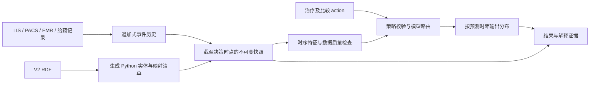

# 患者时序快照、Python 本体类与治疗效果模拟设计

状态：设计提案；尚未实现预测服务或训练模型。以 `ontology/graph/diabetes-ontology-v2.rdf` 为映射输入，保持现有条件推演 API 兼容。

## 1. 功能定义与现状

输入患者在决策时点已知的诊疗历史、一个明确的治疗策略、比较策略以及预测终点，输出未来指标分布、相对基线变化、可用时的治疗效果估计，以及可回溯的解释。快照是“截至某时刻已知的历史视图”，不是把每种检查最后一条值拼在一起。

代码与数据检查结果：

- V2 RDF 有 25 个 `owl:Class`，是业务实体形态图。类映射不能代替 `ontology/src` 中的 OWL 公理和规则。
- `src/dmo/simulate/runner.py` 当前通过用户给定假设值运行两次规则；它明确不外推数值。新增独立 `forecast` 服务，旧 `/simulate` 保持原语义。
- `src/dmo/db/predict.py` 物化风险规则结果，并非机器学习模型。
- `src/dmo/db/etl.py` 全量替换 staging，当前拉取列表没有 PACS，也没有足以重建报告可见时间和实际给药的字段。新增事件历史层，不能直接拿 staging 最新状态做历史训练。
- V2 的 MedicationUse 只有起止日期等字段，没有剂量、频率、实际给药时刻；LabResult 有采样时间但没有报告时间。无法仅凭该 RDF 估计具体用药方案的个人数值响应。

“吃了降血糖的药”先返回 `needs_clarification`：需要药品/支持的策略编码、开始时间、治疗状态（计划/医嘱/已给药/患者自述）、预测指标和时间范围。不得自动选择药品或生成剂量。可接受外部已给定的方案，单独存入预测扩展层；现有 RDF 不增加默认剂量。

## 2. 总体结构



领域实体负责表达事实，action 负责表达干预，模型服务负责预测。禁止把固定降糖公式放进 `Medication.apply()`；否则会把未经学习和验证的假设伪装成药物效果。

## 3. RDF → Python class

构建时生成静态类型代码，而非请求时动态 `type()`。建议使用标准库 frozen dataclass，API DTO 单独验证。生成文件不手改，行为放在独立服务中。

| RDF 元素 | Python 表达 | 约束 |
| --- | --- | --- |
| `owl:Class` | 同名 dataclass，`ClassVar[str] ontology_iri` | 完整 IRI 是身份，不用 label 作为主键 |
| DatatypeProperty | 去所属类前缀后转 snake_case | 清单保留原属性 IRI；同名冲突构建失败 |
| xsd:string / integer / decimal / boolean | str / int / Decimal / bool | 禁止浮点承担原始检验精度 |
| xsd:date / dateTime | date / datetime | date 不冒充零点精确时间；datetime 必须含时区 |
| ObjectProperty | `EntityRef[T]` 或 `tuple[EntityRef[T], ...]` | 通过标识关联，避免对象循环展开 |
| domain / range | 字段归属及目标类型 | 解析器拒绝不支持的匿名表达式 |
| 关系基数注解 | 经确认的 cardinality 映射表 | 不凭关系名称猜单值或多值 |

OWL 开放世界不意味着字段必填；必填、互斥、业务唯一性由单独版本化的验证策略声明。未知值保持 None，不填 0/False；RDF 类型集合保留多重类型，不强制单继承。未支持的继承/限制必须报构建错误或明确列入未映射清单。

生成清单记录 RDF SHA256、生成器版本、全部类/属性/关系 IRI、Python 名称、类型和基数。URI 命名空间 `http://example.org/ontology/diabetes-care-ontology-v2/` 与规则层 `https://example.org/dmo#` 不同，使用显式术语桥接表，禁止字符串替换当作语义对齐。

示意接口（设计代码，不代表已实现）：

```python
@dataclass(frozen=True)
class LabResult:
    ontology_iri: ClassVar[str] = V2 + "LabResult"
    iri: str
    lab_result_id: str | None = None
    result_value: Decimal | None = None
    result_unit: str | None = None
    collected_at: datetime | None = None
    measured_by_test: EntityRef[LabTest] | None = None

class ForecastService(Protocol):
    def simulate(self, snapshot: PatientSnapshot,
                 action: TreatmentAction, comparator: TreatmentAction,
                 target: ForecastTarget) -> SimulationResult: ...
```

全部 25 类均映射：Patient、ClinicalEncounter、ClinicalObservation、Diagnosis、LabResult、LabTest、Assessment、MedicationUse、Medication、DrugClass、DiabetesType、Complication、ComplicationStage、Symptom、RiskFactor、DiagnosticThreshold、GlycemicTarget、Contraindication、AdverseEffect、LifestyleIntervention、Device、MonitoringSchedule、Recommendation、GuidelineSource、SourcePassage。

其中 Patient 汇聚实体引用；LabResult 是观测事实；Assessment 是规则解释；Medication 是知识节点；MedicationUse 是患者用药状态。预测值另建 `PredictedObservation`，不冒充实际 LabResult。

## 4. 快照与双时态事件

新增以下扩展类型，标记 `extension_version`，不声称它们来自当前 RDF：

| 类型 | 必要内容 |
| --- | --- |
| EventEnvelope[T] | event_id、patient_id、source_system、source_record_id、revision、payload、event_time/valid_from/valid_to、source_available_at、ingested_at、status、supersedes、provenance |
| PatientSnapshot | snapshot_id、patient_id、clinical_as_of、knowledge_cutoff、history_start、事件版本引用、各源覆盖区间/水位/缺失原因、内容哈希 |
| ImagingStudy / ImagingReport | study UID、检查时间、报告签发时间、版本、部位、模态、原文引用 |
| ImagingFinding | finding 编码、肯定/否定/不确定、报告片段位置、抽取器版本和置信度 |
| MedicationAdministration | 实际给药时刻、药品、外部方案引用、实施/漏服/不明状态、来源 |
| TreatmentAction | 操作、策略编码、药品/生活方式引用、开始/结束时刻、方案引用、依从性假设 |

时点定义：`clinical_as_of=t0` 是临床预测起点，`knowledge_cutoff=k0` 是系统当时已经知道什么的截点。默认在线 t0=k0。重放服务历史时必须同时满足来源可见时间和系统入库时间不晚于 k0；研究中仅按来源可见时间回放必须单独标记模式，不能称为实际系统当时可见。

快照构建顺序：

1. 校验患者身份、来源、时区与时间精度；不同源的取数水位随快照保存，不声称跨源天然事务一致。
2. 在 k0 前已可见、已入库的版本中，按来源记录标识解析更正/撤回；撤回保留墓碑。严禁先取数据库全局最新版再过滤时间。
3. 提取 t0 前发生的观测历史；诊断/用药状态按有效区间求值。已经知道的未来计划可单列为 plan，不能当成已发生暴露。
4. 依窗口提取特征；保留历史，最新值只是派生特征之一。未签发/初步报告是否允许由特征策略决定并保留状态。
5. 生成不可变快照及哈希；迟到信息生成新快照，不改旧快照或既有预测。

例：08:00 采血，10:00 预测，11:00 报告签发，11:02 入库。10:00 的快照不能使用该数值。12:00 更正报告，12:03 入库；11:30 的历史快照仍使用原报告，不能被新值覆盖。

PACS 同理：昨天完成的影像若今天预测后才签发结论，该结论不能进入特征。首期只处理截至截点可见的结构化发现/报告文本；像素模型是独立后续项目。否定、未检查、未提及、未知必须区分。

若上游只有当前全量快照：从接入起按内容哈希追加版本；历史可见时间无法恢复时标记 `availability_unknown`，不伪造时间，也不用于要求严格历史回放的训练集。

## 5. 时序特征与目标定义

快照接受 LIS、PACS、诊断、生命体征、医嘱、实际给药等数据。各模型声明支持的源、必要特征与有效窗口；PACS 缺失仅在模型支持缺失时可继续，不把缺失影像当作正常。

候选历史窗口为 24h、7d、30d、90d，具体长度由任务验证确定。每个特征保存值、单位、来源事件 ID、窗口、时间年龄、有效样本数及缺失掩码。包括同口径血糖最新值/趋势/波动、既往治疗暴露、测量密度、饮食与就诊背景、肾功能等模型指定变量。连续用药状态与单次给药序列分开，医嘱不等于服药。

必须区分 FPG、餐后血糖、随机血糖、CGM 统计量和 HbA1c，不把不同终点混成“血糖”。基线与预测目标只有在指标、单位和测量语境可比较时才计算差值；HbA1c 的差值用百分点。

`ForecastTarget` 声明 metric、unit、horizons、采样语境、基线最大年龄、未来标签容许窗口及聚合规则。例如任务可以定义第 7/14/28 天的空腹血糖，但这些时距只是工程候选，必须有相应数据验证后才能开放。短期连续曲线需要独立的密集观测数据，不能把离散预测点插值后声称精确病程。

过期规则按特征/目标分别配置。数据不新鲜时输出对应原因；不自动向前填充任意长时间，不把未测量当作零。只有单次观测时不得虚构趋势。

## 6. Action 与未来模拟

支持操作候选：`start`、`continue`、`stop`、`change`、`lifestyle`；首期只开放训练与验证支持的明确策略。`change` 同时描述旧策略结束及新策略开始。action 校验未来时间顺序、重复药品、并用背景和模型支持范围；外部方案参数必须可追溯，不自动推荐。

比较策略默认定义为“延续截至 t0 的既有治疗，不新增本次干预”，并在结果中展示。它不等同于停用所有药物。

服务流程：解析意图 → 构建快照 → 校验 action/目标 → 运行适用性与已有安全规则 → 提取时序特征 → 选择模型 → 同一快照下分别评估治疗与比较策略 → 计算结果分布 → 生成解释和审计记录。

首期采用直接多时距预测，避免把预测值递归作为新事实输入。后续如做状态转移，定义 `S(t+dt)=f(S(t), A[t,t+dt), U, noise)`，两条分支使用相同外生假设/配对随机样本；逐步传播不确定性，输出假设有效范围。预测中途新到真实数据必须创建新快照重新起算。

## 7. 机器学习：预测与治疗效果分开

定义 H 为 t0 前已知历史，Y0 为可比较的基线值：

- `predicted_value(h)`：接受策略 a 时 h 后的指标预测。
- `change_from_baseline(h) = predicted_value(h) - Y0`：负数表示预计下降；展示下降量可取 `Y0 - predicted_value(h)`，允许为负，不截断成零。
- `estimated_treatment_effect(h) = E[Y^a(h)-Y^c(h) | H]`：相对明确比较策略 c 的条件平均效果。它不是已知的个人真实因果效果。

普通回归中的 `E[Y|H,A=a]` 只能支持观察性条件预测；将治疗字段改成另一个值再相减，不能自动获得干预效果。只有满足预先定义的识别假设、研究设计与验证要求，才开放 `causal_estimate` 模式。否则效果字段为 null，并写明“预测变化不能归因于药物”。

首期先比较持续值/简单趋势基线、正则化回归与梯度提升回归，按终点与时距评估。模型选择依据独立验证结果，不预设复杂时序网络更准确。概率输出可采用分位数预测加独立校准；超出训练分布时不能声称区间覆盖率仍成立。

若有合格纵向治疗数据，再设计新使用者、主动比较策略等 target trial emulation：明确入组条件、分配时点、治疗策略、随访、结局、估计目标和分析方案。基线治疗可考虑交叉拟合的双重稳健估计；既往治疗影响后续混杂且治疗反复变化时，评估纵向 g-formula 或边际结构模型，不能把治疗后变量简单塞进基线回归。

处理指征混杂、同期治疗、依从性、缺乏治疗重叠、失访和非随机测量；诊疗越频繁者数据越密集，不能把它当作均匀采样。未测混杂需要敏感性分析。倾向得分极端或有效样本不足时不返回因果效果数值。以上设计与 FDA 非干预研究指导中的研究设计、混杂和偏倚考虑一致，参考 [FDA 指导文件](https://www.fda.gov/media/177128/download)。

训练要求：患者分组并按日历时间切分，跨分界历史窗口/标签窗口不得泄漏；预处理、插补、特征选择只在训练折拟合，校准集与测试集分离。标签必须来自 t0 后预定义窗口，不把失访当作“无变化”，记录测量/失访机制，避免不朽时间偏倚。用合成数据只能验证接口与流水线，不证明药物预测有效。

## 8. “原因说明”的三种语义

| 原因类别 | 可输出内容 | 不能推出的结论 |
| --- | --- | --- |
| 数据/运行原因 | 报告迟到、基线过期、缺少药品、时间冲突、模型不支持 | 数据缺失不等于疾病不存在 |
| 模型预测解释 | 哪些输入对本次输出贡献较大，方向/方法/背景样本/模型版本 | 特征贡献不是病因或药物机制证明 |
| 临床知识与因果证据 | 已有规则路径、SourcePassage 原文出处、因果估计假设和证据等级 | 指南机制不能证明本患者下降某个数值 |

输出 `explanations[]`：type、code、statement、feature/value/unit、event_ids、event_time、available_at、window、method、rule/model_version、source_passage_ids、limitations。病情问题的可能原因标为 hypothesis，列出支持与缺少的证据，不给未经验证的病因定论。

自然语言由这些结构化字段生成；LLM 不负责算预测值，不补不存在的病历、报告或出处。所有“由于……”因果措辞仅能来自具备相应证据的因果说明，其余用“模型使用了/与预测相关”。

## 9. API、存储及输出约定

新增 `POST /patients/{pid}/forecasts`：接受 `snapshot_id` 或内联 snapshot（互斥）、action、comparator、target、mode。内联事件校验患者一致性、时间、单位、版本和负载大小，入历史层后形成不可变快照。单患者授权沿用部署身份体系。

成功体包含 snapshot_id/hash、t0/k0、action/comparator、target、每时距结果、模型/特征/本体/规则版本、数据质量、explanations 与 assumptions。状态枚举：`ok`、`needs_clarification`、`insufficient_data`、`unsupported_scenario`、`out_of_distribution`、`model_unavailable`、`blocked_by_rule`。结构错误返回 422，合法但不能预测返回具原因的业务状态；基础设施失败返回 503，不包装成临床原因。

没有已验证模型时应返回如下结构，而不是演示一个看似真实的下降数值：

```json
{
  "status": "model_unavailable",
  "prediction_kind": "conditional_forecast",
  "predictions": [],
  "estimated_treatment_effect": null,
  "explanations": [{
    "type": "execution",
    "code": "NO_VALIDATED_MODEL",
    "statement": "当前没有覆盖该治疗策略、指标及预测时距的已验证模型。"
  }]
}
```

成功结果每个时距包含：预测均值或中位数及其类型、预测区间及置信水平/校准方法、基线值及时间、相对基线变化、比较策略预测、可用时的效果估计及其置信区间。个人结局预测区间与条件平均效果置信区间分别标注；效果区间不能简单用两个边际区间端点相减获得。

建议独立表：`clinical_event_revision`、`patient_snapshot`、`snapshot_event`、`forecast_run`、`forecast_point`、`model_registry`。原始临床事件与预测派生结果分开存储。run 哈希覆盖快照、action、比较策略、目标、转换/模型/校准器/本体/规则版本及随机种子；相同请求可复现，不能仅依患者 ID 缓存。模型清单记录训练人群、数据范围、支持动作、终点、必要字段、评估与失效条件。

## 10. 交付阶段与验收

1. **实体映射和历史层**：新增 `src/dmo/domain/generated.py`、`mapping.py`，`src/dmo/temporal/events.py`、`snapshot.py`，及生成工具。25 类覆盖率 100%，属性 IRI 可往返，生成结果可重复；新增 PACS/给药适配器及显式扩展类型。
2. **预测契约和纵向数据集**：新增 `src/dmo/forecast/{actions,features,contracts,service}.py`。先实现原因明确的不可预测响应与合成数据演示；完成 as-of 历史特征和未来标签构建，验证无时间泄漏。
3. **条件预测模型**：新增独立训练/评估流水线和 registry；验证合格后开放有限策略/终点/时距。尚无证据前不承诺具体误差指标数值。
4. **治疗效果与动态模拟**：在暴露数据、比较人群与因果识别条件满足后单独开放；与条件预测独立验收。

必要测试：08:00 采样/11:00 报告对 10:00 不可见；迟到更正不改旧快照；撤回/重复/乱序/跨时区/日期精度正确；PACS 否定不变成阳性；患者不串联；医嘱不变成服药；FPG 与随机血糖不混算；缺失不变零；超出支持时距拒绝；预测不写真实事实图；旧 `/simulate` 回归通过；相同版本与种子重放一致。

模型验收按时距报告 MAE、RMSE、系统偏差、区间覆盖率与宽度、缺失/亚组表现、跨时间及条件允许时的外院验证。治疗效果另外报告治疗重叠、混杂平衡、有效样本量及敏感性分析；不能用预测 MAE 证明因果效果准确。报告组织参考 [TRIPOD+AI 官方范围说明](https://www.tripod-statement.org/scope/)。上线后监测漂移、区间覆盖和实际结局，超过预定义阈值停用对应模型版本。

实施前要通过数据审计确定的事项：上游报告签发/更正时间能否取得；实际服药与方案是否可得；PACS 报告来源与结构；可用随访终点与样本量；首期人群、策略、终点和时距。在这些信息缺失时仍可完成类映射、事件层和接口，不应承诺能训练出可信的个人降糖数值模型。
